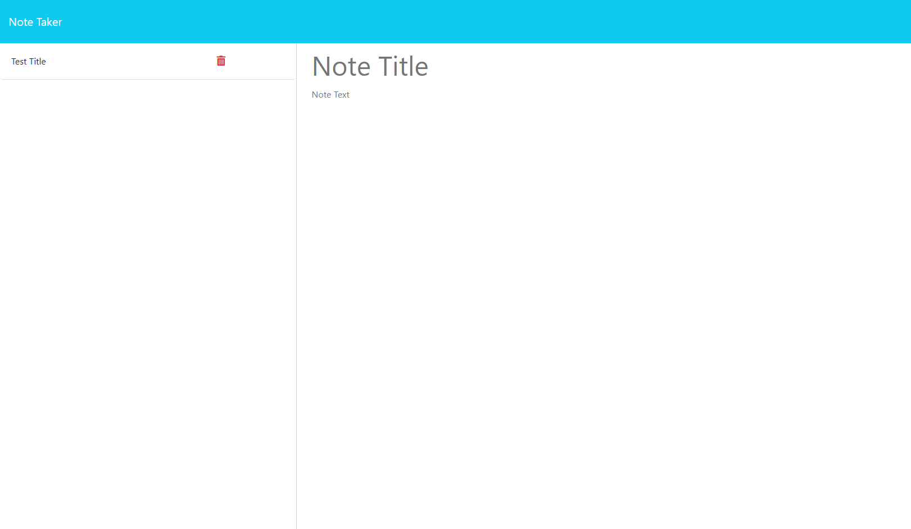
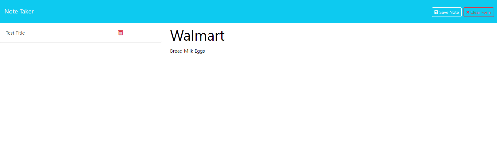
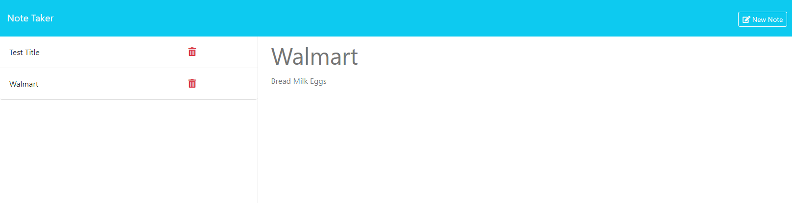

# NOTE TAKER

## Author: Skyler Crawford
| [Deployed-Heroku-Website](https://mysterious-caverns-27801-b704fdaf73ba.herokuapp.com/notes)

## Table of Contents 

- [Description](#description)
- [Installation](#installation)
- [Usage](#usage)
- [Questions](#questions)

## Description

This project is build by using Express.js to connect with the front-end to generate an application for the user to organize their thoughts and to keep track of their tasks.

## Installation

* Starter code was provided, so I ran 'npm install' to ensure all the necessay modules are downloaded.

## Usage

* This is the landing page that the user will see. By clicking the button "Get Started", the user will be directed to the Note Taker page. 

----

* This is the Note Taker page where the user can enter their Note Title and give it content. 

----

* Once the form is filled, a save icon will appear on the top right. The user can click on that save icon and it will save the note to the left side bar shown on the webpage. 

----

* The user's saved notes will be stored unless they have click the red trash icon associated to that list-item. 
* If the user decides to delete the task by clicking on the red trash icon, the list item will disappear once the user enters a new Note Title and Note Text.
* On any page, clicking the Note Taker Header on the top left of the page will take the user to the first landing page.

----

## Questions
If you have any questions heres my email! skyler7crawford@gmail.com